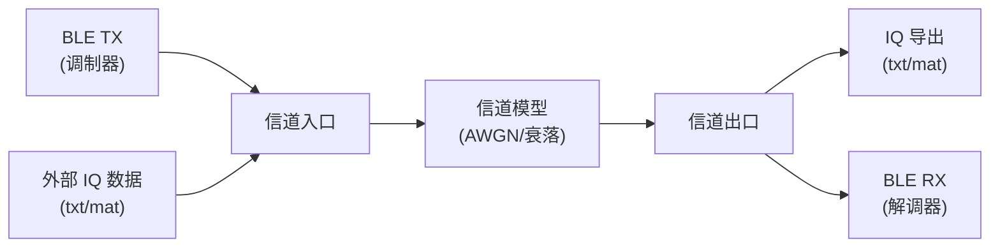

# BLE Studio

BLE 基带算法平台 - 支持 BLE 数据包生成和解调仿真。

## 功能特性

- **数据包生成**: 支持 BLE 4.x/5.x 广播和数据信道包格式
- **RF Test (DTM)**: 直接测试模式，支持 PRBS9/PRBS15/固定模式测试包
- **GFSK 调制**: 符合 BLE 规范的高斯频移键控调制
- **GFSK 解调**: 完整的接收机算法链路
- **信道模型**: AWGN、瑞利/莱斯衰落、多径、室内信道等
- **性能测试**: BER/PER 测试、SNR 扫描、灵敏度测试
- **RF 测试指标**: ΔF1、ΔF2、频率漂移、ICFT、功率等测试仪表盘
- **IQ 数据导入导出**: 支持 Verilog 硬件仿真、MATLAB .mat 文件
- **交互式可视化**: 基于 Plotly 的美观图表，支持频率眼图、RF 指标面板等

## 平台架构

BLE Studio 采用模块化数据流架构，支持灵活的信号导入导出：



### 数据流说明

1. **信道入口 (Channel Input)**: 可以选择使用 BLE TX 调制器生成的信号，或导入外部 IQ 数据文件
2. **信道模型 (Channel Model)**: 对信号施加噪声、频偏、多径衰落等损伤
3. **信道出口 (Channel Output)**: 将经过信道后的信号导出，或送入 BLE RX 解调器

### 信道入口配置

支持导入外部 IQ 数据替代 TX 输出，用于测试实际硬件信号：

```yaml
channel_input:
  enabled: true                    # 启用导入
  file: "captured_signal.txt"      # 导入文件路径
  file_type: "auto"                # auto/txt/mat
  # TXT 文件配置
  bit_width: 12                    # 量化位宽
  frac_bits: 0                     # Q 格式小数位
  iq_format: "two_column"          # two_column/interleaved/separate
  number_format: "signed"          # signed/unsigned/hex/float
  skip_lines: 0                    # 跳过头部行数
  # MAT 文件配置
  mat_i_var: "I"                   # I 数据变量名
  mat_q_var: "Q"                   # Q 数据变量名
  mat_complex_var: ""              # 复数变量名 (可选)
```

### 信道出口配置

支持将信道输出导出为多种格式：

```yaml
channel_output:
  enabled: true                    # 启用导出
  bit_width: 12                    # 量化位宽
  frac_bits: 0                     # Q 格式小数位
  iq_format: "two_column"          # two_column/interleaved/separate
  number_format: "signed"          # signed/unsigned/hex
  add_header: true                 # 添加文件头注释
  # 导出格式选择
  export_txt: true                 # 导出 TXT 文件
  export_mat: true                 # 导出 MATLAB .mat 文件
  export_verilog: false            # 导出 Verilog $readmemh 格式
  export_separate: false           # 导出分离的 I/Q 文件
  export_tx: true                  # 同时导出 TX 理想信号
```

### 使用场景

| 场景 | 信道入口 | 信道出口 |
|------|---------|---------|
| 纯软件仿真 | 使用 BLE TX | 送入 BLE RX |
| 硬件信号分析 | 导入采集的 IQ 数据 | 送入 BLE RX 解调 |
| 生成测试向量 | 使用 BLE TX | 导出 txt/mat/mem |
| 联合仿真 | 导入外部 IQ | 导出处理后的 IQ |

## 安装

```bash
# 克隆项目
git clone <repository-url>
cd BLEStudio

# 安装 (开发模式)
pip install -e .

# 安装开发依赖 (包含绘图支持)
pip install -e ".[dev]"
```

## 快速开始

### 运行示例

```bash
# 1. 使用默认配置运行 (RF Test 模式)
python examples/demo.py

# 2. 使用指定配置文件
python examples/demo.py examples/config_rftest_pattern.yaml
```

运行后在 `results/` 目录生成 HTML 报告，浏览器打开 `results/index.html` 查看结果。

### 预置配置文件

| 配置文件 | 用途 | 说明 |
|---------|------|------|
| `config.yaml` | 默认配置 | RF Test 模式，PRBS9，SNR=15dB |
| `config_rftest_pattern.yaml` | 频谱测试 | 0x55 交替模式，高 SNR，关闭白化 |
| `config_rftest_prbs9.yaml` | DTM 测试 | PRBS9 伪随机序列 |
| `config_rftest_2m_prbs15.yaml` | 2M PHY 测试 | LE 2M，PRBS15 序列 |
| `config_advertising.yaml` | 广播包测试 | BLE 广播数据包 |
| `config_low_snr.yaml` | 灵敏度测试 | 低 SNR 环境 |
| `config_ideal.yaml` | 理想信道 | 无噪声，无频偏 |

### 常用配置修改

**修改 `examples/config.yaml`：**

```yaml
# 切换仿真模式
mode: "rf_test"        # rf_test (DTM) 或 advertising (广播包)

# RF Test 参数
rf_test:
  payload_type: "PRBS9"     # PRBS9/PRBS15/PATTERN_10101010/...
  payload_length: 37        # 0-255 bytes
  channel: 0                # 0-39
  whitening: false          # DTM 应关闭

# 信道参数
channel:
  snr_db: 15                # 信噪比
  freq_offset: 50.0e3       # 载波频偏 (Hz)

# 查看 TX 理想信号 (bypass 信道)
channel:
  snr_db: 100               # 高 SNR = 几乎无噪声
  freq_offset: 0            # 无频偏
```

### 运行示例命令

```bash
# RF Test - PRBS9 (默认)
python examples/demo.py

# RF Test - 0x55 交替模式 (频谱测试)
python examples/demo.py examples/config_rftest_pattern.yaml

# RF Test - 2M PHY PRBS15
python examples/demo.py examples/config_rftest_2m_prbs15.yaml

# 广播包模式
python examples/demo.py examples/config_advertising.yaml

# 低 SNR 灵敏度测试
python examples/demo.py examples/config_low_snr.yaml

# 理想信道 (查看 TX 理想波形)
python examples/demo.py examples/config_ideal.yaml
```

### 输出文件

运行后在 `results/` 目录生成：

| 文件 | 说明 |
|------|------|
| `index.html` | 首页 (RX 端图表 + 解调结果) |
| `charts.html` | TX/RX 对比图表页面 |
| `report.html` | 详细仿真报告 |
| `iq_tx_ideal.txt/mat` | TX 理想 IQ 数据 |
| `iq_channel_out.txt/mat` | 信道输出 IQ 数据 |


### 生成 BLE 广播数据包

```python
from ble_studio import BLEPacket
from ble_studio.packet import BLEPacketConfig, BLEPhyMode, create_advertising_packet

# 方式1: 使用便捷函数创建广播包
adv_address = bytes([0x11, 0x22, 0x33, 0x44, 0x55, 0x66])
adv_data = bytes([0x02, 0x01, 0x06])  # Flags

packet = create_advertising_packet(
    adv_address=adv_address,
    adv_data=adv_data,
    channel=37
)

# 生成比特流
bits = packet.generate()
print(f"数据包长度: {len(bits)} bits")

# 方式2: 自定义配置
config = BLEPacketConfig(
    phy_mode=BLEPhyMode.LE_1M,
    channel=37,
    access_address=0x8E89BED6,
    pdu_type=0x00,
    payload=adv_address + adv_data
)
packet = BLEPacket(config)
bits = packet.generate()
```

### GFSK 调制

```python
from ble_studio import BLEModulator
from ble_studio.modulator import ModulatorConfig

# 配置调制器
config = ModulatorConfig(
    phy_mode=BLEPhyMode.LE_1M,
    sample_rate=8e6,         # 8 MHz 采样率
    modulation_index=0.5,    # 调制指数
    bt=0.5                   # 高斯滤波器 BT 积
)

modulator = BLEModulator(config)

# 调制
iq_signal = modulator.modulate(bits)

# 添加信道损伤
noisy_signal = modulator.add_noise(iq_signal, snr_db=15)
signal_with_cfo = modulator.add_frequency_offset(noisy_signal, freq_offset=50e3)
```

### GFSK 解调

```python
from ble_studio import BLEDemodulator
from ble_studio.demodulator import DemodulatorConfig

# 配置解调器
config = DemodulatorConfig(
    phy_mode=BLEPhyMode.LE_1M,
    sample_rate=8e6,
    access_address=0x8E89BED6,
    channel=37
)

demodulator = BLEDemodulator(config)

# 解调
result = demodulator.demodulate(iq_signal)

if result.success:
    print(f"解调成功!")
    print(f"CRC 校验: {'通过' if result.crc_valid else '失败'}")
    print(f"RSSI: {result.rssi:.2f} dB")
    print(f"频偏: {result.freq_offset/1e3:.2f} kHz")
    print(f"PDU: {result.pdu.hex()}")
```

### 可视化 (Plotly)

```python
from ble_studio import BLEVisualizer, plot_ble_signal

# 创建可视化器
viz = BLEVisualizer()

# IQ 时域波形 (分离 I/Q)
fig = viz.plot_iq_time(iq_signal, sample_rate=8e6, title='IQ 时域波形')
fig.show()  # 在浏览器中显示
fig.write_html('iq_time.html')  # 保存为 HTML

# IQ 时域波形 (叠加)
fig = viz.plot_iq_combined(iq_signal, sample_rate=8e6)
fig.show()

# 频谱图
fig = viz.plot_spectrum(iq_signal, sample_rate=8e6, fft_size=4096)
fig.show()

# 时频谱图 (瀑布图)
fig = viz.plot_spectrogram(iq_signal, sample_rate=8e6)
fig.show()

# 星座图
fig = viz.plot_constellation(iq_signal, downsample=8)
fig.show()

# 比特流
fig = viz.plot_bits(bits, max_bits=200)
fig.show()

# 瞬时频率偏移
fig = viz.plot_frequency_deviation(iq_signal, sample_rate=8e6)
fig.show()

# 眼图 (幅度)
fig = viz.plot_eye_diagram(demod_signal, samples_per_symbol=8)
fig.show()

# 频率眼图 (GFSK 专用，基于瞬时频率)
fig = viz.plot_frequency_eye_diagram(iq_signal, sample_rate=8e6, samples_per_symbol=8)
fig.show()

# RF 测试指标计算
metrics = viz.calculate_rf_metrics(iq_signal, sample_rate=8e6, samples_per_symbol=8)
print(f"ΔF1 平均: {metrics['delta_f1_avg']:.1f} kHz")
print(f"ΔF2 平均: {metrics['delta_f2_avg']:.1f} kHz")
print(f"频率漂移: {metrics['freq_drift']:.1f} kHz")
print(f"ICFT: {metrics['icft']:.1f} kHz")
print(f"平均功率: {metrics['p_avg_dbm']:.1f} dBm")
print(f"峰值功率: {metrics['p_peak_dbm']:.1f} dBm")

# RF 测试仪表盘 (类似蓝牙测试仪显示)
fig = viz.plot_rf_metrics_panel(metrics, title='RF 测试指标')
fig.show()

# 综合仪表板 (一次显示多个图表)
fig = viz.create_dashboard(iq_signal, sample_rate=8e6, bits=bits)
fig.show()

# 快捷函数
fig = plot_ble_signal(iq_signal, sample_rate=8e6, bits=bits)
fig.show()
```

### 数据信道 PDU

```python
from ble_studio import DataChannelPDU, DataPDUType, create_data_packet

# 创建空 PDU (保持连接)
empty_pdu = DataChannelPDU.create_empty_pdu(nesn=0, sn=0)

# 创建数据 PDU
data_pdu = DataChannelPDU.create_data_pdu(
    payload=b'\x01\x02\x03\x04',
    nesn=0, sn=0, md=0, is_start=True
)

# 创建控制 PDU
version_pdu = DataChannelPDU.create_ll_version_ind()
terminate_pdu = DataChannelPDU.create_ll_terminate_ind(error_code=0x13)
feature_pdu = DataChannelPDU.create_ll_feature_req()
length_pdu = DataChannelPDU.create_ll_length_req()
phy_pdu = DataChannelPDU.create_ll_phy_req(tx_phys=0x01, rx_phys=0x01)

# 创建完整数据信道数据包
packet = create_data_packet(
    pdu=data_pdu,
    access_address=0x12345678,
    crc_init=0x123456,
    channel=0
)
```

### RF Test (DTM) 射频测试

```python
from ble_studio.packet import (
    RFTestPacket, RFTestConfig, RFTestPayloadType,
    RFTestPayloadGenerator, create_test_packet, BLEPhyMode
)

# 方式1: 使用便捷函数创建测试包
packet = create_test_packet(
    payload_type=RFTestPayloadType.PRBS9,
    payload_length=37,
    channel=0,
    phy_mode=BLEPhyMode.LE_1M
)

# 生成比特流
bits = packet.generate()

# 获取测试信息
info = packet.get_test_info()
print(f"PHY: {info['phy_mode']}")
print(f"信道: {info['channel']} ({info['frequency_mhz']} MHz)")
print(f"负载类型: {info['payload_type']}")

# 方式2: 直接生成 PRBS 序列
prbs9_data = RFTestPayloadGenerator.generate_prbs9(37)
prbs15_data = RFTestPayloadGenerator.generate_prbs15(100)

# 方式3: 使用配置对象
config = RFTestConfig(
    phy_mode=BLEPhyMode.LE_2M,
    channel=19,
    payload_type=RFTestPayloadType.PRBS15,
    payload_length=255
)
packet = RFTestPacket(config)

# 支持的测试负载类型
# - PRBS9: PRBS9 伪随机序列 (x^9 + x^5 + 1)
# - PRBS15: PRBS15 伪随机序列 (x^15 + x^14 + 1)
# - PATTERN_11110000: 0xF0 重复
# - PATTERN_10101010: 0x55 重复
# - PATTERN_11111111: 0xFF 全1
# - PATTERN_00000000: 0x00 全0
# - PATTERN_00001111: 0x0F 重复
# - PATTERN_01010101: 0xAA 重复
```

### IQ 数据导入导出 (Verilog 仿真)

```python
from ble_studio import (
    IQExporter, IQImporter, IQExportConfig, IQImportConfig,
    IQFormat, NumberFormat,
    export_iq_txt, export_iq_verilog, import_iq_txt, import_iq_mat,
)

# ========== 导出 IQ 数据 ==========

# 方式1: 便捷函数导出
info = export_iq_txt(
    iq_signal,
    'output/iq_data.txt',
    bit_width=12,          # 量化位宽
    frac_bits=0,           # Q 格式小数位 (Q12.0)
    iq_format='two_column', # 每行: I Q
    number_format='signed', # 有符号整数
    add_header=True        # 添加文件头注释
)

# 导出 Verilog $readmemh 格式
export_iq_verilog(iq_signal, 'output/iq_data.mem', bit_width=12)

# 方式2: 使用导出器 (更多控制)
config = IQExportConfig(
    bit_width=14,                          # 14 位量化
    frac_bits=11,                          # Q3.11 格式
    iq_format=IQFormat.INTERLEAVED,        # I0 Q0 I1 Q1 ...
    number_format=NumberFormat.HEX,        # 十六进制输出
    add_header=True,
)
exporter = IQExporter(config)

# 导出到文本文件
exporter.export_txt(iq_signal, 'output/iq_hex.txt')

# 导出 I/Q 分离文件
exporter.export_separate_files(iq_signal, 'output/i_data.txt', 'output/q_data.txt')

# 导出 Verilog 内存格式 (I/Q 打包)
exporter.export_verilog_mem(iq_signal, 'output/iq.mem')

# ========== 导入 IQ 数据 ==========

# 从文本文件导入
signal = import_iq_txt(
    'input/iq_data.txt',
    bit_width=12,
    frac_bits=0,
    iq_format='two_column',
    number_format='signed',
    skip_lines=7  # 跳过文件头
)

# 从 MATLAB .mat 文件导入
signal, sample_rate = import_iq_mat(
    'input/ble_signal.mat',
    i_var='I',           # I 数据变量名
    q_var='Q',           # Q 数据变量名
    # complex_var='iq'   # 或使用复数变量名
)

# 方式2: 使用导入器
importer = IQImporter(IQImportConfig(
    bit_width=12,
    iq_format=IQFormat.TWO_COLUMN,
    number_format=NumberFormat.SIGNED,
))
signal = importer.import_txt('input/iq_data.txt')
signal = importer.import_verilog_mem('input/iq.mem')
```

**导出文件格式示例:**

```
// BLE Studio IQ Data Export
// Bit Width: 12
// Q Format: Q12.0
// Samples: 1856
//
1933 226
1877 511
1762 824
...
```

**Verilog 使用示例:**

```verilog
reg [23:0] iq_mem [0:1855];  // 12bit I + 12bit Q

initial begin
    $readmemh("iq_data.mem", iq_mem);
end

wire [11:0] i_data = iq_mem[addr][23:12];
wire [11:0] q_data = iq_mem[addr][11:0];
```

### 信道模型

```python
from ble_studio import (
    BLEChannel, ChannelConfig, ChannelType,
    create_awgn_channel, create_fading_channel, create_ble_indoor_channel
)

# 简单 AWGN 信道
channel = create_awgn_channel(snr_db=15)
rx_signal = channel.apply(tx_signal)

# 瑞利衰落信道
channel = create_fading_channel(snr_db=15, doppler_freq=10, channel_type='rayleigh')
rx_signal = channel.apply(tx_signal)

# 莱斯衰落信道
channel = create_fading_channel(snr_db=15, doppler_freq=10, channel_type='rician')
rx_signal = channel.apply(tx_signal)

# BLE 室内信道 (含多径)
channel = create_ble_indoor_channel(snr_db=15, environment='office')
rx_signal = channel.apply(tx_signal)

# 自定义信道 (多种损伤组合)
config = ChannelConfig(
    channel_type=ChannelType.MULTIPATH,
    snr_db=15,
    frequency_offset=50e3,           # 50 kHz 频偏
    timing_offset=0.5,               # 定时偏移
    iq_amplitude_imbalance=1.0,      # 1dB IQ 幅度失衡
    iq_phase_imbalance=5.0,          # 5度 IQ 相位失衡
    dc_offset_i=0.01,                # I 路 DC 偏移
    dc_offset_q=0.01,                # Q 路 DC 偏移
    path_delays=[0, 50e-9, 100e-9],  # 多径延迟
    path_gains=[0, -3, -6],          # 多径增益 (dB)
)
channel = BLEChannel(config)
rx_signal = channel.apply(tx_signal)
```

### BER/PER 性能测试

```python
from ble_studio import (
    quick_ber_test, quick_snr_sweep, plot_ber_curve,
    BLEPerformanceTester, TestConfig, BLEPhyMode
)

# 快速 BER 测试
result = quick_ber_test(snr_db=10, num_packets=100)
print(f"BER: {result.ber:.2e}, PER: {result.per:.2%}")

# SNR 扫描测试
report = quick_snr_sweep(
    snr_start=0,
    snr_stop=20,
    snr_step=2,
    num_packets=100
)

# 绘制 BER/PER 曲线
fig = plot_ber_curve(report, show_theoretical=True)
fig.show()

# 自定义测试配置
config = TestConfig(
    phy_mode=BLEPhyMode.LE_1M,
    snr_start=-5,
    snr_stop=25,
    snr_step=1,
    num_packets=500,
    payload_length=37,
    frequency_offset=10e3,  # 带频偏测试
)
tester = BLEPerformanceTester(config)
report = tester.run_snr_sweep()

# 灵敏度测试 (找到 30.8% PER 对应的 SNR)
sensitivity = tester.run_sensitivity_test(target_per=0.308)
print(f"灵敏度: {sensitivity:.2f} dB")
```

### 小工具 (utils/)

`utils/` 目录包含独立的小工具脚本：

```bash
# SNR 扫描测试 - 测试不同信噪比下的解调性能
python utils/snr_sweep.py

# IQ 导入导出验证 - 测试 IQ 数据导入导出的正确性
python utils/iq_corr_test.py

# RF 测试指标验证 - 验证调制器是否符合 BLE RF 标准
python utils/rf_metrics_test.py

# 调制器分析 - 分析 GFSK 调制器的频率脉冲、相位、IQ 特性
python utils/modulator_analysis.py

# Visualizer RF 指标测试 - 测试图表中 RF 指标计算的正确性
python utils/visualizer_rf_test.py
```

**SNR 扫描测试输出示例:**

```
============================================================
BLE Studio - SNR 扫描测试
============================================================
测试次数: 20 次/SNR点
频偏: 50 kHz
------------------------------------------------------------
  SNR (dB) |       成功率 |     CRC通过率 |    数据匹配率
------------------------------------------------------------
         0 |        0.0% |        0.0% |        0.0%
         5 |       15.0% |       10.0% |       10.0%
        10 |       85.0% |       80.0% |       80.0%
        14 |      100.0% |      100.0% |      100.0%
------------------------------------------------------------
```

输出示例:

```
============================================================
BLE 数据包生成演示
============================================================
数据包比特数: 256
数据包字节数: 32

前导码 (8 bits): [1 0 1 0 1 0 1 0]
接入地址 (32 bits): [0 1 1 0 1 0 1 1 ...]

============================================================
BLE GFSK 调制演示
============================================================
采样率: 8.0 MHz
符号率: 1.0 Msps
每符号采样数: 8
IQ 信号长度: 2048 采样点
信号时长: 256.00 us

============================================================
BLE GFSK 解调演示
============================================================
解调成功: True
CRC 校验: 通过
RSSI: -0.12 dB
频偏估计: 48.23 kHz
```

## 项目结构

```
BLEStudio/
├── ble_studio/
│   ├── __init__.py       # 包入口
│   ├── packet.py         # BLE 数据包生成 (广播+数据信道+RF Test)
│   ├── modulator.py      # GFSK 调制器
│   ├── demodulator.py    # GFSK 解调器
│   ├── channel.py        # 信道模型
│   ├── performance.py    # BER/PER 性能测试
│   ├── visualizer.py     # Plotly 可视化 (含 RF 测试指标)
│   ├── report.py         # HTML 报告生成
│   └── iq_io.py          # IQ 数据导入导出 (Verilog/MATLAB)
├── examples/
│   ├── demo.py                    # 演示程序
│   ├── config.yaml                # 默认配置文件
│   ├── config_advertising.yaml    # 广播包测试配置
│   ├── config_rftest_prbs9.yaml   # RF Test PRBS9 配置
│   ├── config_rftest_2m_prbs15.yaml  # RF Test 2M PRBS15 配置
│   ├── config_rftest_pattern.yaml # RF Test 固定模式配置
│   ├── config_low_snr.yaml        # 低 SNR 灵敏度测试配置
│   ├── config_channel_scan.yaml   # 全信道扫描配置
│   └── config_ideal.yaml          # 理想信道测试配置
├── utils/                # 小工具/脚本目录
│   ├── snr_sweep.py      # SNR 扫描测试 (不同信噪比解调性能)
│   ├── iq_corr_test.py   # IQ 导入导出验证 (相关性测试)
│   ├── rf_metrics_test.py    # RF 测试指标验证 (ΔF1/ΔF2)
│   ├── modulator_analysis.py # 调制器分析 (频率脉冲/相位/IQ)
│   └── visualizer_rf_test.py # Visualizer RF 指标测试
├── results/              # 输出目录 (HTML 报告, IQ 数据)
├── pyproject.toml        # 项目配置
├── requirements.txt      # 依赖列表
└── README.md
```

## 技术规格

### 支持的 PHY 模式

| 模式 | 符号率 | 调制方式 |
|------|--------|----------|
| LE 1M | 1 Msps | GFSK |
| LE 2M | 2 Msps | GFSK |

### 数据包格式

```
┌──────────┬─────────────┬─────────┬───────┐
│ Preamble │ Access Addr │   PDU   │  CRC  │
│  8/16b   │    32b      │ 16-2056b│  24b  │
└──────────┴─────────────┴─────────┴───────┘
```

### 算法参数

- **调制指数**: 0.5 (BLE 规范)
- **高斯滤波器 BT**: 0.5
- **CRC 多项式**: x²⁴ + x¹⁰ + x⁹ + x⁶ + x⁴ + x³ + x + 1
- **白化多项式**: x⁷ + x⁴ + 1

## 依赖

- Python >= 3.8
- NumPy >= 1.20.0
- SciPy >= 1.7.0
- Plotly >= 5.10.0

## 可视化图表类型

| 图表类型 | 方法 | 说明 |
|---------|------|------|
| IQ 时域 | `plot_iq_time()` | I/Q 分量分离显示 |
| IQ 叠加 | `plot_iq_combined()` | I/Q 分量叠加显示 |
| 频谱图 | `plot_spectrum()` | FFT 功率谱密度 |
| 时频谱 | `plot_spectrogram()` | 瀑布图/热力图 |
| 星座图 | `plot_constellation()` | IQ 散点图 |
| 比特流 | `plot_bits()` | 数字信号阶梯图 |
| 瞬时频率 | `plot_frequency_deviation()` | GFSK 频率偏移 |
| 眼图 | `plot_eye_diagram()` | 符号间叠加 (幅度) |
| 频率眼图 | `plot_frequency_eye_diagram()` | GFSK 瞬时频率眼图 |
| RF 指标计算 | `calculate_rf_metrics()` | ΔF1/ΔF2/漂移/功率等 |
| RF 仪表盘 | `plot_rf_metrics_panel()` | 仿真仪器显示面板 |
| 仪表板 | `create_dashboard()` | 综合多图显示 |

### 图表颜色自定义

图表支持仪器风格主题（黑底亮色谱线），可在 `ble_studio/visualizer.py` 中修改 `INSTRUMENT_COLORS` 字典来自定义配色：

**可用主题**：
| 主题    | 说明 |
|--------|------|
|  default| 白底，蓝色谱线 |
|  dark| 深灰底，浅色文字 |
|  instrument| 纯黑底，亮黄色谱线（仿频谱仪） |

```python
# ble_studio/visualizer.py 第 26-42 行
INSTRUMENT_COLORS = {
    'primary': '#FFFF00',      # 主谱线颜色 (亮黄色)
    'secondary': '#00FF00',    # 次要颜色 (亮绿色)
    'tertiary': '#00FFFF',     # 第三颜色 (青色)
    'quaternary': '#FF8800',   # 第四颜色 (橙色)
    'trace1': '#FFFF00',       # I 分量颜色
    'trace2': '#00FF00',       # Q 分量颜色
    'background': '#000000',   # 页面背景色 (纯黑)
    'plot_bg': '#000000',      # 绘图区背景色
    'grid': '#404040',         # 网格线颜色
    'grid_minor': '#202020',   # 次网格线颜色
    'text': '#FFFFFF',         # 文字颜色
    'title': '#FFFF00',        # 标题颜色
    'axis': '#808080',         # 坐标轴颜色
    'reference': '#FF0000',    # 参考线颜色
}
```

**常用颜色调整:**

| 配置项 | 说明 | 建议值 |
|--------|------|--------|
| `trace1` | I 分量波形颜色 | `#FFFF00` (黄), `#00FF00` (绿) |
| `trace2` | Q 分量波形颜色 | `#00FF00` (绿), `#00FFFF` (青) |
| `background` | 背景色 | `#000000` (纯黑), `#0a0a0a` (深灰) |
| `primary` | 主谱线/单波形颜色 | `#FFFF00` (黄), `#00FFFF` (青) |

**使用主题:**

```python
from ble_studio import BLEVisualizer

# 仪器风格 (黑底亮色)
viz = BLEVisualizer(theme='instrument')

# 默认风格 (白底)
viz = BLEVisualizer(theme='default')
```

修改颜色后重新运行 `python examples/demo.py` 生成报告即可查看效果。


### RF 测试指标说明

| 指标 | 说明 | BLE 规范要求 |
|------|------|------------|
| ΔF1 | 相邻 '1' 和 '0' 符号的频率差 | ≥ 185 kHz |
| ΔF2 | 稳定 '1' 和 '0' 的平均频率差 | ≥ 185 kHz |
| ΔF2/ΔF1 | 调制质量比 | ≥ 0.8 |
| Freq Drift | 频率漂移 (包内) | - |
| Drift Rate | 漂移率 | - |
| ICFT | 初始载波频率偏差 | ±150 kHz |
| P AVG | 平均功率 (dBm) | - |
| P PEAK | 峰值功率 (dBm) | - |

## 信道模型

| 信道类型 | 类/函数 | 说明 |
|---------|--------|------|
| AWGN | `AWGNChannel` | 加性高斯白噪声 |
| 瑞利衰落 | `RayleighChannel` | 无直射路径的衰落信道 |
| 莱斯衰落 | `RicianChannel` | 有直射路径的衰落信道 |
| 多径 | `MultipathChannel` | 自定义多径延迟和增益 |
| BLE 室内 | `BLEIndoorChannel` | 预设室内环境 (办公室/住宅/工业) |
| 频偏 | `FrequencyOffset` | 载波频偏和漂移 |
| 定时偏移 | `TimingOffset` | 采样时钟偏差 |
| IQ 失衡 | `IQImbalance` | 幅度和相位失衡 |
| DC 偏移 | `DCOffset` | I/Q 直流偏移 |
| 相位噪声 | `PhaseNoise` | 振荡器相位噪声 |

## 许可证

MIT License
